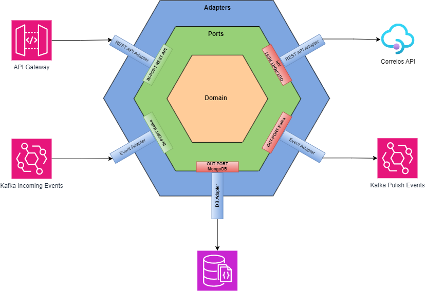
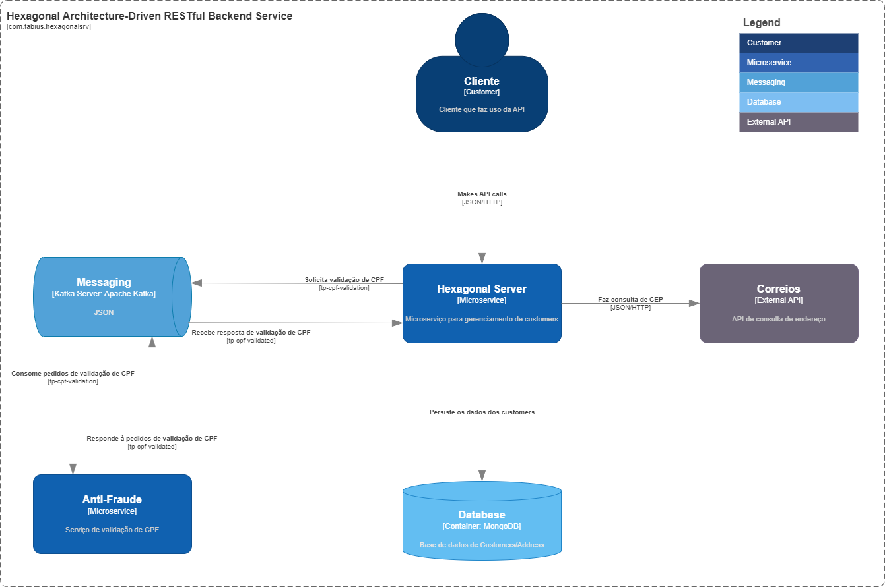

# Arquitetura Hexagonal
A Arquitetura Hexagonal, também conhecida como `Ports and Adapters`, é um paradigma de design de software que visa promover a flexibilidade, modularidade e testabilidade em aplicações. Essa abordagem busca desacoplar o núcleo da lógica de negócios da implementação específica de tecnologias externas, como interfaces de usuário, bancos de dados e serviços externos. O conceito central da Arquitetura Hexagonal é representado por três camadas principais: `Adaptadores`, `Application` e `Ports`.

Na Arquitetura Hexagonal, a camada de Adaptadores inclui os componentes que interagem com o mundo externo, como interfaces de usuário, serviços web e bancos de dados. A camada de Application abriga a lógica de negócios central da aplicação, enquanto a camada de Ports define interfaces que representam contratos entre as diferentes partes do sistema. Essa abordagem facilita a substituição de componentes externos sem afetar a lógica de negócios, tornando o código mais modular e passível de testes automatizados.

A Arquitetura Hexagonal é particularmente valiosa em ambientes em constante evolução, nos quais a mudança de tecnologias ou a integração de novos serviços é uma realidade comum. Ao isolar as preocupações específicas de implementação, a Arquitetura Hexagonal oferece uma base sólida para o desenvolvimento de aplicações resilientes, escaláveis e adaptáveis.

A imagem abaixo mostra as 3 principais camadas da arquitetura hexagonal já contextualizando a aplicação.<br>


# Motivação
A motivação por trás da criação deste projeto baseado na Arquitetura Hexagonal surge de um desejo profundo de aprimorar o entendimento prático desse design inovador, explorando suas vantagens e desafios no contexto de uma aplicação real. Optei por implementar essa arquitetura sólida e modular em um cenário que envolve REST API, mensageria e banco de dados, utilizando a linguagem de programação Java e o renomado framework Spring.

A escolha por um design baseado em Arquitetura Hexagonal visa principalmente a obtenção de um código mais flexível e testável, com a capacidade de se adaptar a mudanças no ambiente externo sem comprometer a essência da lógica de negócios. Ao adotar essa abordagem, almejo alcançar uma clara separação entre as diferentes camadas do sistema, permitindo que a lógica de domínio, contida na camada domain, permaneça independente das tecnologias externas.

Contudo, o principal motivador para esse projeto estende-se além do domínio da Arquitetura Hexagonal, abrangendo também a busca por uma compreensão mais profunda das nuances e distinções entre os princípios da Arquitetura Limpa e a Arquitetura Hexagonal. Ao explorar ambos os designs, pretendo não apenas aprimorar meu conhecimento prático, mas também discernir as características distintivas que cada abordagem traz para o desenvolvimento de software.

# Sobre o Projeto
O projeto apresenta um backend especializado em operações CRUD (Registro, Consulta, Alteração e Exclusão) para clientes, disponibilizado por meio de uma REST API simplificada. Desenvolvida com Java e Spring Boot como frameworks principais, a aplicação faz uso do MongoDB como banco de dados e se beneficia da eficiência da mensageria assíncrona com Apache Kafka.

O projeto trata-se de uma aplicação de backend que oferece o serviço de Registro, Consulta, Alteração e Exclusão (CRUD) para clientes, disponibilizado por meio de uma REST API simplificada.
A aplicação é baseada no Spring Boot. Faz uso do MongoDB como banco de dados para a persistência dos dados e conecta-se ao Apache Kafka, como produtor e consumidor, utilizando-o como meio comunicação assíncrono com outro microserviço.

Durante o registro e alteração dos dados do cliente, a aplicação realiza consultas de CEP a API externa, enriquecendo o projeto com uma abordagem mais próxima da realidade. Adicionalmente, a validação assíncrona do CPF é realizada por meio do Kafka, onde a aplicação envia mensagem de solicitação de validação e atualiza os dados dos registros quando recebe o retorno.

O modelo C4 abaixo ilustra o contexto geral do microserviço:<br>
 


# Requisitos
A aplicação demanda certos requisitos essenciais para seu funcionamento otimizado e para atender às expectativas de negócio.

- [Java 17+](https://www.oracle.com/technetwork/pt/java/javase/downloads/index.html)
- [Maven 3.9.x](https://maven.apache.org/download.cgi)
- [MongoDB](https://www.mongodb.com/)
- [Apache Kafka](https://kafka.apache.org/)
- Docker (opcional)
- Docker-Compose (opcional)


## Bibliotecas
O projeto faz uso de diversas bibliotecas essenciais para o seu desenvolvimento e operação eficaz. As principais bibliotecas e dependências incluem:

- **Spring Boot Starter Validation**: Essencial para a validação de dados, esta biblioteca do Spring Boot fornece suporte integrado para garantir a integridade dos dados durante as operações CRUD.

- **Spring Boot Starter Web**: Usado para desenvolvimento de aplicativos da web, este starter do Spring Boot facilita a construção de APIs RESTful, contribuindo para a criação da interface de comunicação da aplicação.

- **Spring Cloud Starter OpenFeign**: Essa biblioteca permite a integração eficiente com serviços web externos, simplificando a comunicação com a API de CEP durante as operações de registro e alteração.

- **Spring Boot Starter Data MongoDB**: Facilita a integração do MongoDB como banco de dados, simplificando as operações de persistência e recuperação de dados.

- **Spring Kafka**: Oferece suporte para a integração com o Apache Kafka, permitindo a comunicação assíncrona entre os diferentes componentes do sistema.

- **MapStruct**: Utilizada para simplificar e automatizar a conversão de objetos, a biblioteca MapStruct agrega eficiência ao mapeamento de dados entre diferentes camadas da aplicação.

- **Lombok**: Uma biblioteca que simplifica a escrita de código Java, reduzindo a necessidade de códigos boilerplate. Sua utilização contribui para um código mais limpo e legível.


# Estrutura de diretório
A estrutura de diretório do projeto é uma parte crucial para manter a organização e a clareza no desenvolvimento da aplicação. A seguir, apresentamos a árvore de diretórios adotada para separar as camadas:

```
├── adapters
│   ├── in
│   │   ├── consumer
│   │   │   ├── mapper
│   │   │   │   └── ...
│   │   │   └── message
│   │   │       └── ...
│   │   └── controller
│   │       ├── mapper
│   │       │   └── ...
│   │       ├── request
│   │       │   └── ...
│   │       └── response
│   │           └── ...
│   └── out
│       ├── client
│       │   ├── mapper
│       │   │   └── ...
│       │   └── response
│       │       └── ...
│       └── repository
│           ├── entity
│           │   └── ...
│           └── mapper
│               └── ...
├── application
│   ├── core
│   │   ├── domain
│   │   │   └── ...
│   │   └── usecases
│   │       └── ...
│   └── ports
│       ├── in
│       │   └── ...
│       └── out
│           └── ...
└── config
    └── ...
```

## Domain
Na camada `domain`, encontramos a essência do negócio, incluindo entidades, objetos de valor e as regras de negócio. Esta camada é projetada para ser independente da infraestrutura, proporcionando uma representação fiel do domínio do problema.
Dentro da estrutura de diretórios, a camada `Domain` está localizada em `./appliation/core/`.

## Ports
A camada `ports` define as interfaces que conectam as diferentes partes do sistema. Ela se subdivide em `in` (portas de entrada) e `out` (portas de saída). As portas de entrada representam os casos de uso que a aplicação expõe para o mundo externo, enquanto as portas de saída representam as interfaces para acessar recursos externos.
Dentro da estrutura de diretórios, a camada `Ports` está localizada em `./appliation/ports/`.

## Adapters
Os adaptadores conectam as portas do sistema ao mundo exterior. Na camada `in`, eles adaptam as entradas externas para casos de uso internos. Na camada `out`, adaptam as saídas internas para os recursos externos.
Dentro da estrutura de diretórios, a camada `Adapters` está localizada em `./apdaters/`.

## Factories
As factories são responsáveis pela instanciação dos casos de uso definidos na camada application. Dentro do projeto, essas factories são classes que fazem uso das anotations `@Configuration` e `@Bean` do Spring para instanciar e configurar os UseCases de forma automática.


# Preparando ambiente local


### MongoDB
Durante o startup da aplicação o MongoClient, driver client utilizado para acessar o MongoDB, irá automaticamente estabelecer uma conexão. Sendo necessário ter um servidor MongoBD funcional e acessível.

Para instanciar um servidor MongoDB localmente dentro de um container docker, basta executar:<br>

```
docker run --name mongodb -p 27017:27017 -e MONGO_INITDB_ROOT_USERNAME=root -e MONGO_INITDB_ROOT_PASSWORD=example -d mongodb/mongodb-community-server:latest
```

### Apache Kafka
Ao contrário do MongoDB, não é pré-requisito para o startup da aplicação que o ambiente tenha um servidor Apache Kafka disponível e acessível para conexão.

Para criar um servidor Kafka localmente dentro de containers, execute:<br>

```
docker run --name zookeeper -p 2181:2181 -e ALLOW_ANONYMOUS_LOGIN=yes -d bitnami/zookeeper:latest
```

e após o zookeeper estar, execute:<br>

```
docker run --name kafka -p 9092:9092 -e KAFKA_BROKER_ID=1 -e KAFKA_CFG_LISTENERS=PLAINTEXT://:9092 -e KAFKA_CFG_ADVERTISED_LISTENERS=PLAINTEXT://127.0.0.1:9092 -e KAFKA_CFG_ZOOKEEPER_CONNECT=zookeeper:2181 -e ALLOW_PLAINTEXT_LISTENER=yes -d bitnami/kafka:latest
```

Uma vez que o servidor Apache Kafka foi devidamente inicializado, é necessário criar manualmente os dois tópicos (`tp-cpf-validation` e `tp-cpf-validated`).


### Usando Docker-Compose

O arquivo `docker-compose-dsv.yml`, localizado no raiz do projeto, pode ser usado para facilitar a instanciação do servidor MongoDB e kafka.<br>

```bash
docker-compose -f ./docker-compose-dsv.yml up -d
```

# Building
A compilação do projeto requer o maven instalado.<br>
Em linha de comando basta executar:<br>

```bash
mvn clean package
```

# Running
Uma vez finalizado o build do projeto, a execução em linha de comando pode ser feita através do comando abaixo:<br>

```bash
java -jar ./target/hexagonalsrv-0.0.1-SNAPSHOT.jar
```
